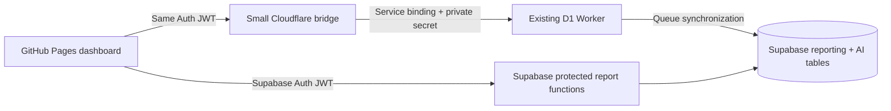

# Ricochet reporting website

This project moves the reporting user interface to GitHub Pages and makes Supabase the direct reporting source. The existing D1 Worker continues synchronizing leads, calls, notes, recordings, and AI results into Supabase. A new, small Cloudflare Worker is used only for protected recording playback and AI commands.

The website uses one Supabase Auth login. It never asks for a report API key after login, and it never receives a Supabase service-role key, an OpenAI key, or a recording-administration secret.

## What is included

- Clean responsive sidebar and organized shared filters
- Overview, Team, Calls & AI, Notes, Leads, CSV lead filter, AI Teacher, and Connections pages
- Visibility-aware auto-refresh, manual refresh, dark mode, pagination, and CSV export
- Canonical live count: first live/appointment status in the selected range **and** the live email passed the note check and was sent
- Fast Team page: one pre-aggregated Supabase function replaces the old sequence of large Worker queries
- Notes page: every note receives up to 25 de-duplicated recordings for the same exact lead; the exact matched call is marked and sorted first
- CSV upload: normalized phone first, then email, in batches of 200; 5 MB and 5,000-row browser limits
- Private recording and AI bridge authenticated with the user's Supabase login token

## Architecture



## 1. Prepare Supabase

1. Open the Supabase project used by the `ricochet-reporting-staging` Hyperdrive connection.
2. Open **SQL Editor**.
3. Run [`supabase/001_github_dashboard_api.sql`](supabase/001_github_dashboard_api.sql) once. This is the coexistence-safe installation and preserves all permissions used by the current dashboard.
4. In **Authentication → Users**, invite or create the person who should log in.
5. Authorize that user with this SQL, changing the email:

```sql
insert into public.report_users (user_id, display_name, role)
select id, email, 'admin'
from auth.users
where email = 'you@example.com'
on conflict (user_id) do update
set active = true, role = excluded.role;
```

6. In **Authentication → URL Configuration**, add the final GitHub Pages URL to the redirect allow list. This is required for emailed sign-in links.

The installation does not change existing grants on the synchronized `reporting` and `ai` tables, so the current dashboard can remain online while the new website is tested. The new website calls only the bounded dashboard functions after both Supabase login and the `report_users` allow-list check succeed.

After the new website is verified and the old browser dashboard is retired, you may review and run [`supabase/002_optional_lockdown_after_cutover.sql`](supabase/002_optional_lockdown_after_cutover.sql). Do not run that optional file during parallel testing because it can stop an older browser application that reads the synchronized tables directly.

## 2. Deploy the small Cloudflare bridge

The target private D1 Worker must already be deployed. In your account it is currently named `ricochet-lead-worker-d1-test`.

1. Copy `worker-bridge/wrangler.example.jsonc` to `worker-bridge/wrangler.jsonc`.
2. In that file, update:
   - `SUPABASE_URL`
   - `SUPABASE_PUBLISHABLE_KEY` — use the publishable/anon key, never service role
   - `ALLOWED_ORIGINS` — for a project Pages URL, the origin is only `https://YOUR_USER.github.io` (no repository path)
   - the `PRIVATE_D1_WORKER` service name if yours differs
3. Set the one private outbound secret:

```powershell
cd worker-bridge
npx wrangler secret put PRIVATE_WORKER_API_KEY
```

`PRIVATE_WORKER_API_KEY` must equal a key accepted by the private D1 Worker. Its `REPORT_API_KEY` is accepted for recording and AI administration. If the old value is forgotten, generate a new random value and update all callers that currently connect to that private Worker; do not put the value in the website or GitHub.

4. Deploy:

```powershell
npx wrangler deploy
```

5. Copy the deployed `https://...workers.dev` URL for the GitHub setup.

The bridge has an exact CORS allow list, verifies the Supabase JWT by calling the protected `dashboard_authorized()` RPC, bounds JSON bodies to 64 KB, and forwards only explicitly allow-listed recording/AI routes through a Cloudflare service binding.

## 3. Publish the website through GitHub

Create a new GitHub repository and put the **contents of this folder** at the repository root. The included workflow assumes `package.json` is at the root.

In **GitHub repository → Settings → Secrets and variables → Actions → Variables**, create:

| Variable | Value |
|---|---|
| `SUPABASE_URL` | `https://YOUR_PROJECT.supabase.co` |
| `SUPABASE_PUBLISHABLE_KEY` | Supabase publishable/anon key |
| `WORKER_BASE_URL` | Deployed Cloudflare bridge URL |
| `AUTO_REFRESH_SECONDS` | `60` (optional) |

These three URL/publishable values are browser configuration, not private credentials. Never create a GitHub variable containing a service-role key, OpenAI key, D1 database credential, or recording-administration key.

Then:

1. Open **Settings → Pages**.
2. Under **Build and deployment**, select **GitHub Actions**.
3. Push to the `main` branch or run **Deploy Ricochet dashboard to GitHub Pages** from the Actions tab.
4. Open the Pages URL and sign in with the Supabase user created above.

The workflow installs the pinned package lock, builds the Vite site, uploads only `dist`, and deploys that artifact to Pages.

## Auto-refresh behavior and tradeoffs

Auto-refresh defaults to 60 seconds and refreshes only the page currently visible. It pauses when the browser tab is hidden or the device is offline. CSV uploads and the Connections page never poll. Filters are applied only when **Apply filters** is clicked, so typing cannot repeatedly query Supabase.

New leads or newly live leads appear after two events:

1. the existing D1 synchronization reaches Supabase; and
2. the active page reaches its next refresh or the user clicks **Refresh**.

The downside of a shorter interval is multiplied database/API traffic for every open user and tab, more mobile battery/network usage, and a higher chance of seeing a partially synchronized lead between its lead, call, note, and AI updates. Sixty seconds is a good operational default. Use 30 seconds only for a small team; use 120 seconds for many concurrent users or large date ranges.

## Local preview

```powershell
npm install
npm run dev
```

Without local environment values, development shows safe sample data so the layout can be reviewed. To test real login/data, copy `.env.example` to `.env.local`, add only the public values, and restart Vite.

## Validation commands

```powershell
npm ci
npm run build
node --test worker-bridge/index.test.js
node --check worker-bridge/index.js
```

## Files to keep private

- `.env`, `.env.local`, `.dev.vars`
- Cloudflare `PRIVATE_WORKER_API_KEY`
- Supabase service-role/secret key
- OpenAI API key
- any OAuth encryption or recording-administration secret

They are ignored by `.gitignore`. The public Supabase publishable key is safe in the browser only because all access is restricted by Supabase Auth, the report allow list, function grants, and RLS.
