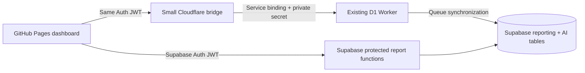

# Ricochet reporting website

This project moves the reporting user interface to GitHub Pages and makes Supabase the direct reporting source. The existing D1 Worker continues synchronizing leads, calls, notes, recordings, and AI results into Supabase. A new, small Cloudflare Worker is used only for protected recording playback and AI commands.

The website uses one Supabase Auth login. It never asks for a report API key after login, and it never receives a Supabase service-role key, an OpenAI key, or a recording-administration secret.

## What is included

- Clean responsive sidebar and organized shared filters
- Overview, Team, Calls & AI, Notes, Leads, CSV lead filter, AI Teacher, and Connections pages
- Visibility-aware auto-refresh, manual refresh, dark mode, pagination, and CSV export
- Canonical live count: first live/appointment status in the selected range **and** the live email passed the note check and was sent
- Fast Team page: one pre-aggregated Supabase function replaces the old sequence of large Worker queries
- Notes page: every note receives up to 25 de-duplicated recordings for the same exact lead; the exact matched call is marked and sorted first
- CSV upload: normalized phone first, then email, with set-based Supabase matching in resilient 50-row browser batches; 5 MB and 5,000-row browser limits
- CSV results can be searched and filtered locally by match state, lead status, lead type, vendor, and agent without another database query; exports follow the visible filtered rows.
- Lead names in both the Leads directory and matched CSV results open the complete notes, calls, recording, owner, and timeline popup.
- State-dependent county and metro checklists backed by the supplied Zillow ZIP geography; choosing a state starts with every county and metro included. Missing ZIPs use a conservative city/state fallback only when that city belongs to exactly one county in the state.
- Leads exports include every filtered result—not only the visible page. The existing name, address, contact, status, county, metro, and ownership columns remain selected by default, and an export popup can add optional identity, timing, source, appointment, and geography-audit fields.
- Optional lead-export fields now include note counts, latest note/date/owner, up to 100 notes, call and recording counts, latest call details, recording UUID, and up to 100 calls per lead.
- Report-table headers are clickable. Date-based lead, call, bonus-review, and AI-review tables start newest-to-oldest; clicking a header toggles ascending and descending order.
- Calls & AI restores the old selectable-call workflow: select visible or individual calls, launch the installed Windows Local AI for the selection/current range, copy the manual command as a fallback, or queue selected/all matching calls through paid OpenAI with an explicit reanalysis option.
- Every call has an on-demand AI review popup with the recording, transcript, source/model, score, status and note comparison, summary, recommendation, coaching, missing questions, matched note, and Local/Paid reanalysis actions.
- Overview shows average and median created-to-first-call time, the share called within five minutes, and never-called received leads. Per-lead created time, first call, first caller/direction, and elapsed time are available in the export chooser.
- Private recording and AI bridge authenticated with the user's Supabase login token

## Architecture



## 1. Prepare Supabase

1. Open the Supabase project used by the `ricochet-reporting-staging` Hyperdrive connection.
2. Open **SQL Editor**.
3. Run [`supabase/001_github_dashboard_api.sql`](supabase/001_github_dashboard_api.sql) once. This is the coexistence-safe installation and preserves all permissions used by the current dashboard.
4. Run [`supabase/003_county_metro_filters.sql`](supabase/003_county_metro_filters.sql) to add the secured ZIP geography table and the county/metro-aware report functions.
5. In the Supabase web SQL Editor, run every file inside [`supabase/zip_geo_chunks`](supabase/zip_geo_chunks) in numeric order from `004_01` through `004_07`. These smaller files load 26,274 ZIP mappings without exceeding the editor's query-size limit. They include all 67 Florida counties and 29 Florida metro areas. The single large [`supabase/004_zip_geo_lookup_data.sql`](supabase/004_zip_geo_lookup_data.sql) is retained only for direct `psql`/database connections.
6. Run [`supabase/005_unique_city_county_fallback.sql`](supabase/005_unique_city_county_fallback.sql). This builds the safe city/state fallback and updates Leads, filtering, and full exports to use exact ZIP first and unique-city county second.
7. Run [`supabase/006_lead_export_notes_calls.sql`](supabase/006_lead_export_notes_calls.sql). This adds the secured, field-aware export function used only when downloading all filtered leads, so note and call history is loaded only when selected.
8. Run [`supabase/007_call_ai_review.sql`](supabase/007_call_ai_review.sql). This adds the secured full call-analysis popup data and enriches the Calls & AI rows with their Local/Paid model and processing status.
9. Run [`supabase/008_first_call_response_time.sql`](supabase/008_first_call_response_time.sql). This adds first-response KPIs to Overview and the original created time, first logged call, first-call owner/direction, and elapsed seconds to the lead export.
10. Run [`supabase/009_note_call_timeline_linking.sql`](supabase/009_note_call_timeline_linking.sql). This keeps exact note/call matches first, adds a same-lead timeline fallback for out-of-order webhooks, and exposes the call AI controls and analysis popup from Notes.
11. Run [`supabase/010_companion_lead_reporting.sql`](supabase/010_companion_lead_reporting.sql). This mirrors the source worker's Buyer/Seller form-heading rules, identifies Buyer companions created from Seller Forms and Seller companions created from Buyer Forms, adds the global Lead origin filter, and creates a separate audited companion-bonus ledger on Team.
12. Run [`supabase/011_large_range_performance.sql`](supabase/011_large_range_performance.sql) during a quiet minute. It adds date, lead, phone, call, and note indexes used by large dashboard ranges and gives the bounded report functions enough execution time to finish.
13. Run [`supabase/012_live_note_gate_reconciliation.sql`](supabase/012_live_note_gate_reconciliation.sql). It separates Team activity from bonus reconciliation for faster loading, accepts the synchronized note date when the typed form date is stale, and distinguishes a truly missing form from a missing ISA or missing live disposition.
14. Run [`supabase/013_authoritative_companion_decisions.sql`](supabase/013_authoritative_companion_decisions.sql). It stores audited manager approvals/retractions for the separate companion records whose authoritative creation flags live in the LeadFlow D1 Worker.
15. Run [`supabase/014_field_aware_lead_type.sql`](supabase/014_field_aware_lead_type.sql). It makes the Notes badge and Lead Type filter use completed form answers: Buyer Forms become **Buyer and Seller** only when **HOME TO SELL FIRST?** is affirmative; Seller Forms become **Buyer and Seller** only when their buy-side answers contain real intent. Empty template labels do not count.
16. Run [`supabase/015_lead_status_bonus_gate.sql`](supabase/015_lead_status_bonus_gate.sql). It uses the synchronized lead's 2.3, 2.4, or 2.5 status for bonus eligibility, so a structured formal note does not need to repeat the status in a `DISPOSITION:` field.
17. In **Authentication → Users**, invite or create the person who should log in.
18. Authorize that user with this SQL, changing the email:

```sql
insert into public.report_users (user_id, display_name, role)
select id, email, 'admin'
from auth.users
where email = 'you@example.com'
on conflict (user_id) do update
set active = true, role = excluded.role;
```

19. In **Authentication → URL Configuration**, add the final GitHub Pages URL to the redirect allow list. This is required for emailed sign-in links.

For an existing installation that already ran migrations through `014`, run only `015`. If an earlier migration is still missing, run all missing migrations in numeric order through `015`. Selecting a state initially leaves the county and metro gates inactive, which means every lead in that state remains included even if no geography can be resolved. The gate activates only after you uncheck a county or metro.

The secondary fallback never guesses between counties. An exact five-digit ZIP match always wins. If the ZIP is blank or absent from the lookup, `005` tries normalized city + state only when every lookup row for that city points to one county. Ambiguous or unknown cities remain **Unmapped**. The Leads table labels fallback results, and the optional **Geography Match Source** export field records whether each row used ZIP, city/state fallback, or no match.

To rebuild the geography seed from a newer Zillow file later:

```powershell
node scripts/build-zip-geo-sql.mjs "C:\path\to\Zip_zhvi_uc_sfrcondo_tier_0.33_0.67_sm_sa_month.csv"
```

The installation does not change existing grants on the synchronized `reporting` and `ai` tables, so the current dashboard can remain online while the new website is tested. The new website calls only the bounded dashboard functions after both Supabase login and the `report_users` allow-list check succeed.

After the new website is verified and the old browser dashboard is retired, you may review and run [`supabase/002_optional_lockdown_after_cutover.sql`](supabase/002_optional_lockdown_after_cutover.sql). Do not run that optional file during parallel testing because it can stop an older browser application that reads the synchronized tables directly.

## 2. Deploy the small Cloudflare bridge

The target private D1 Worker must already be deployed. In your account it is currently named `ricochet-lead-worker-d1-test`.

1. Copy `worker-bridge/wrangler.example.jsonc` to `worker-bridge/wrangler.jsonc`.
2. In that file, update:
   - `SUPABASE_URL`
   - `SUPABASE_PUBLISHABLE_KEY` — use the publishable/anon key, never service role
   - `ALLOWED_ORIGINS` — for a project Pages URL, the origin is only `https://YOUR_USER.github.io` (no repository path)
   - the `PRIVATE_D1_WORKER` service name if yours differs
   - `LEADFLOW_WORKER` — the Worker that owns the delivery report and the explicit `created_from_note` fields
3. Set the one private outbound secret:

```powershell
cd worker-bridge
npx wrangler secret put PRIVATE_WORKER_API_KEY
npx wrangler secret put LEADFLOW_ADMIN_TOKEN
```

`PRIVATE_WORKER_API_KEY` must equal a key accepted by the private D1 Worker. Its `REPORT_API_KEY` is accepted for recording and AI administration. If the old value is forgotten, generate a new random value and update all callers that currently connect to that private Worker; do not put the value in the website or GitHub.

`LEADFLOW_ADMIN_TOKEN` must equal the existing admin token used to sign in to the LeadFlow delivery report. It stays only in the bridge Worker. It is used for a read-only request for records explicitly marked `created_from_note`; the browser never receives this token.

4. Deploy:

```powershell
npx wrangler deploy
```

5. Copy the deployed `https://...workers.dev` URL for the GitHub setup.

The bridge has an exact CORS allow list, verifies the Supabase JWT by calling the protected `dashboard_authorized()` RPC, bounds JSON bodies to 64 KB, and forwards only explicitly allow-listed recording/AI routes through a Cloudflare service binding.

## 3. Publish the website through GitHub

Create a new GitHub repository and put the **contents of this folder** at the repository root. The included workflow assumes `package.json` is at the root.

In **GitHub repository → Settings → Secrets and variables → Actions → Variables**, create:

| Variable | Value |
|---|---|
| `SUPABASE_URL` | `https://YOUR_PROJECT.supabase.co` |
| `SUPABASE_PUBLISHABLE_KEY` | Supabase publishable/anon key |
| `WORKER_BASE_URL` | Deployed Cloudflare bridge URL |
| `AUTO_REFRESH_SECONDS` | `60` (optional) |

These three URL/publishable values are browser configuration, not private credentials. Never create a GitHub variable containing a service-role key, OpenAI key, D1 database credential, or recording-administration key.

Then:

1. Open **Settings → Pages**.
2. Under **Build and deployment**, select **GitHub Actions**.
3. Push to the `main` branch or run **Deploy Ricochet dashboard to GitHub Pages** from the Actions tab.
4. Open the Pages URL and sign in with the Supabase user created above.

The workflow installs the pinned package lock, builds the Vite site, uploads only `dist`, and deploys that artifact to Pages.

## Auto-refresh behavior and tradeoffs

Auto-refresh defaults to 60 seconds and refreshes only the page currently visible. It pauses when the browser tab is hidden or the device is offline. CSV uploads and the Connections page never poll. Filters are applied only when **Apply filters** is clicked, so typing cannot repeatedly query Supabase.

Large report requests retry transient Supabase statement, network, and gateway timeouts up to three times with a short backoff. The page shows an error only if all attempts fail. Migration `011` should still be installed because retries improve recovery but indexes are what reduce the underlying query time.

New leads or newly live leads appear after two events:

1. the existing D1 synchronization reaches Supabase; and
2. the active page reaches its next refresh or the user clicks **Refresh**.

The downside of a shorter interval is multiplied database/API traffic for every open user and tab, more mobile battery/network usage, and a higher chance of seeing a partially synchronized lead between its lead, call, note, and AI updates. Sixty seconds is a good operational default. Use 30 seconds only for a small team; use 120 seconds for many concurrent users or large date ranges.

## Monthly live-lead bonus control

Running `supabase/001_github_dashboard_api.sql` creates the append-only `live_bonus_decisions` audit table and the secured manager action used by the Team page.

- **Live leads sent** is the complete first-live + sent-email population and reconciles to the Overview definition.
- **Payable bonuses** includes only formal Buyer/Seller notes with a 2.3, 2.4, or 2.5 disposition whose note owner matches the form ISA, plus manager-approved exceptions.
- ISA ownership matching accepts exact names, first-name abbreviations and spelling variants (`Valeri`/`Valerie`, `Dieg`/`Diego`), controlled nicknames (`Patty Diaz`/`Patricia Diaz`), a shortened name against a longer legal name (`Francisco Barragan`/`Francisco Javier Barragan Moran`), a one-character surname spelling variation (`Domingues`/`Dominguez`), and the verified `Abraham Guzman`/`Abraham Zavala` identity alias. Compact form fields such as `Patty DiazCURRENT...` are stopped at the next field label instead of being treated as part of the ISA name.
- **Needs review** keeps ownership conflicts out of payroll until a manager chooses the credited agent.
- **Waiting/missing note** keeps a lead visible but not payable while the one-day webhook-delay window is open or when required evidence never arrives.
- **Retracted** removes an incorrect live status from the payable count without deleting its audit history. It does not rewrite Ricochet; correct the operational lead status there separately when needed.

Only users with `manager` or `admin` in `public.report_users` can approve, retract, or restore a bonus decision. To promote an existing authorized user:

Clicking a lead in **Team → Audit and corrections** opens the on-demand review window with lead details, ownership evidence, all synchronized notes, the latest call and caller, the call/recording timeline, and the complete bonus decision history. Approving or rejecting advances to the next lead; the X button or Escape closes the review.

## Companion Buyer/Seller bonus control

Migration `010` provides a compatibility fallback for older synchronized data. The current Team ledger reads the authoritative LeadFlow D1 fields instead: `created_from_note = 1` plus `note_creation_direction = seller_to_buyer` or `buyer_to_seller`. An explicit **Seller Form** remains Seller; when that workflow creates its separate buy side, the generated lead is labeled **Buyer created from Seller Form**. An explicit **Buyer Form** remains Buyer; its generated sell side is labeled **Seller created from Buyer Form**. Ordinary note text is no longer used as the primary companion count.

The Team page shows created buyers, created sellers, payable companion bonuses, exceptions, and retractions separately from the live-lead bonus ledger. Automatic credit uses the `ISA:` written in the companion form. Managers can approve a different agent, retract a companion bonus, or restore automatic review without changing Ricochet data. The Leads page, CSV matcher, global Lead origin filter, and lead export use the same labels.

```sql
update public.report_users
set role = 'admin', active = true
where user_id = (select id from auth.users where email = 'YOUR_EMAIL');
```

## Local preview

```powershell
npm install
npm run dev
```

Without local environment values, development shows safe sample data so the layout can be reviewed. To test real login/data, copy `.env.example` to `.env.local`, add only the public values, and restart Vite.

## Validation commands

```powershell
npm ci
npm run build
node --test worker-bridge/index.test.js
node --check worker-bridge/index.js
```

## Files to keep private

- `.env`, `.env.local`, `.dev.vars`
- Cloudflare `PRIVATE_WORKER_API_KEY`
- Supabase service-role/secret key
- OpenAI API key
- any OAuth encryption or recording-administration secret

They are ignored by `.gitignore`. The public Supabase publishable key is safe in the browser only because all access is restricted by Supabase Auth, the report allow list, function grants, and RLS.
